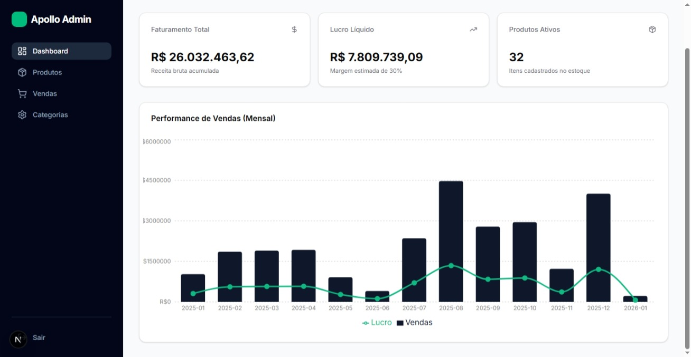
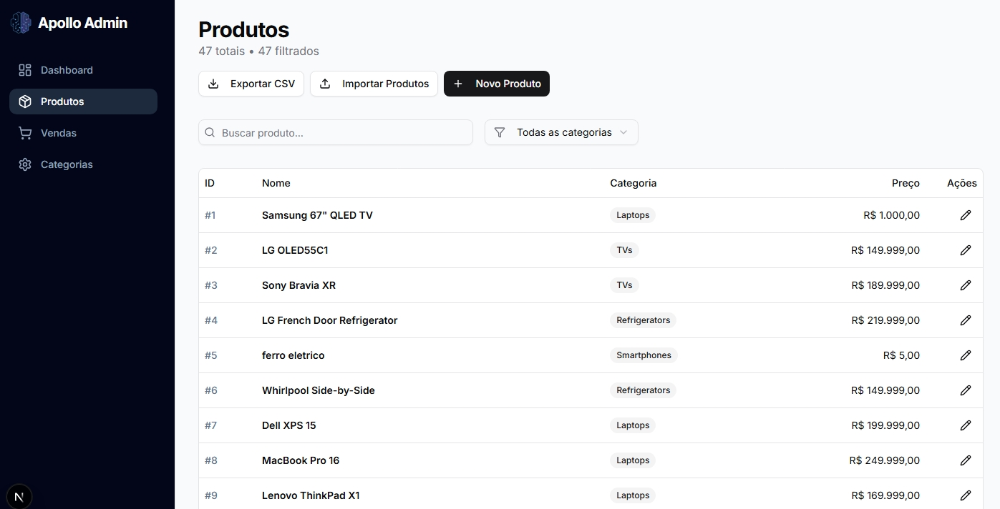
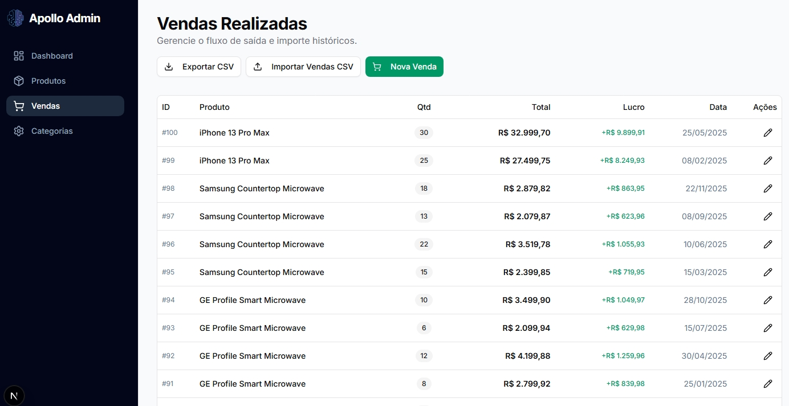

# 🛍️ Apollo SmartMart - Frontend

Interface moderna e responsiva para o sistema de gestão de varejo **Apollo SmartMart**. Desenvolvida com **Next.js**, **TypeScript** e componentes de alta qualidade para garantir performance e usabilidade excepcional.

---

## 📸 Screenshots

  

---

## ✨ Funcionalidades

### 📊 Dashboard Interativo
- KPIs em tempo real exibindo Faturamento, Lucro e Total de Produtos
- Gráficos de desempenho de vendas mensais utilizando Recharts
- Visualização intuitiva de métricas estratégicas do negócio

### 📦 Gestão de Produtos
- Listagem completa com recursos de busca e filtros avançados
- Cadastro manual de produtos com validação de dados
- **Upload de CSV** para importação em massa de produtos
- Integração inteligente e automática com sistema de categorias

### 💰 Gestão de Vendas
- Histórico completo e detalhado de transações
- Registro manual de vendas com cálculo automático de totais
- Importação de histórico de vendas via arquivo CSV
- Cálculo automático de lucro estimado com margem de 30%

### 🏷️ Categorias
- Visualização organizada de departamentos e categorias
- Correção de nomes de categorias através de upload de arquivo
- Gerenciamento simplificado da hierarquia de produtos

---

## 🚀 Tecnologias Utilizadas

- **Core:** [Next.js 15](https://nextjs.org/) (App Router) & [React](https://react.dev/)
- **Linguagem:** [TypeScript](https://www.typescriptlang.org/)
- **Estilização:** [Tailwind CSS](https://tailwindcss.com/)
- **Componentes UI:** [Shadcn/ui](https://ui.shadcn.com/) (Radix UI)
- **Ícones:** [Lucide React](https://lucide.dev/)
- **Gráficos:** [Recharts](https://recharts.org/)
- **Requisições HTTP:** [Axios](https://axios-http.com/)

---

## 📂 Estrutura do Projeto

```bash
frontend/
├── app/                          # Rotas do Next.js (App Router)
│   ├── categories/               # Página de Categorias
│   ├── products/                 # Página de Produtos
│   ├── sales/                    # Página de Vendas
│   └── page.tsx                  # Dashboard (Home)
├── components/                   # Componentes Reutilizáveis
│   ├── ui/                       # Componentes base do Shadcn
│   ├── CsvUploadModal.tsx        # Modal de upload CSV
│   ├── RegisterSaleSheet.tsx     # Painel de registro de vendas
│   ├── StatsCard.tsx             # Cartões de estatísticas
│   └── ...
├── lib/
│   └── api.ts                    # Configuração do Axios
└── screenshots/                  # Capturas de tela do projeto
```

---

## ⚙️ Pré-requisitos

Antes de começar, certifique-se de ter instalado:

- **Node.js** (v18 ou superior)
- O **Backend** do projeto rodando (geralmente na porta 8000)

---

## 🔧 Instalação e Execução

### 1. Acesse a pasta do frontend

```bash
cd frontend
```

### 2. Instale as dependências

```bash
npm install
# ou
yarn install
```

### 3. Configure as Variáveis de Ambiente

Crie um arquivo `.env.local` na raiz da pasta `frontend` e adicione a URL da sua API:

```bash
NEXT_PUBLIC_API_URL=http://127.0.0.1:8000
```
ou

Ambiente de produção (deploy)

```NEXT_PUBLIC_API_URL_PROD=https://apollo-backend-z7dh.onrender.com```

### 4. Inicie o servidor de desenvolvimento

```bash
npm run dev
```

### 5. Acesse no navegador

Abra [http://localhost:3000](http://localhost:3000) para visualizar a aplicação.

---

## 🎨 Layout e UI

O projeto utiliza um **layout persistente** com Sidebar para navegação fluida entre as diferentes seções do sistema. Os componentes foram construídos pensando na experiência do usuário, incluindo:

- **Loaders** para indicação de carregamento
- **Mensagens de erro amigáveis** para melhor comunicação
- **Feedback visual** através de Toasts/Alerts
- **Design responsivo** que se adapta a diferentes tamanhos de tela
- **Componentes acessíveis** seguindo as melhores práticas de UI/UX

---

## 📄 Licença

Este projeto faz parte de um desafio técnico fullstack. Sinta-se livre para usar como base para estudos e desenvolvimento de projetos similares.

---

